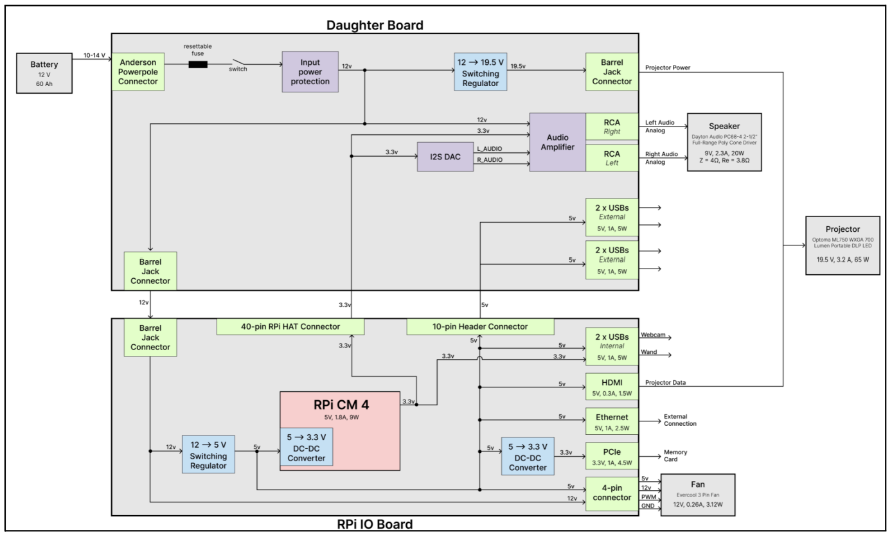
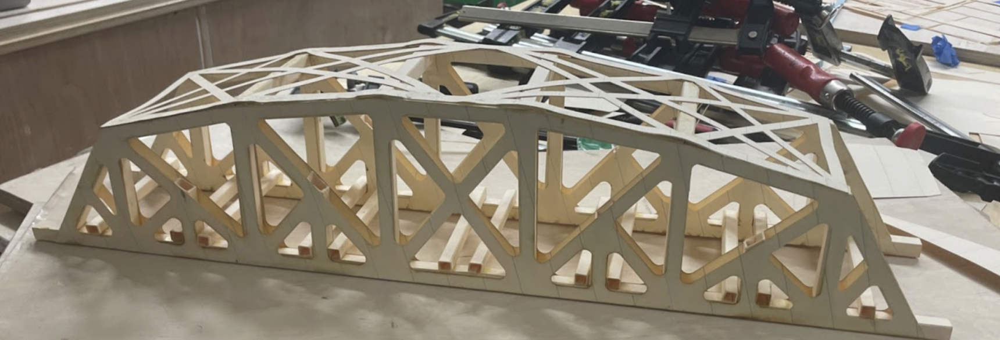

## All Projects

  <a href="/projects/looma-redesign" class="card">
        
        

        <h3 class="card-title">Looma Electrical Redesign</h3>
        
System & PCB Design of Looma Educational System

        

    </a>

  <a href="/projects/inverter" class="card">
    
    

      <h3 class="card-title">Split-phase Grid-tied High-Power Inverter</h3>
      
For residential load-shedding battery system

    

  </a>

  <a href="/projects/solar-water-heating" class="card">
    
    

      <h3 class="card-title">Solar Water-Heating System</h3>
      
Built and operating in Uganda

    

  </a>

  <a href="/projects/truss-bridge" class="card">
    
    

      <h3 class="card-title">Truss Bridge</h3>
      
SolidWorks, FEA

    

  </a>

  <a href="/projects/island-opt" class="card">
    
    

      <h3 class="card-title">Island Energy Optimization</h3>
      
Tesla Sales Engineering Case Study

    

  </a>

 

[< back](./)