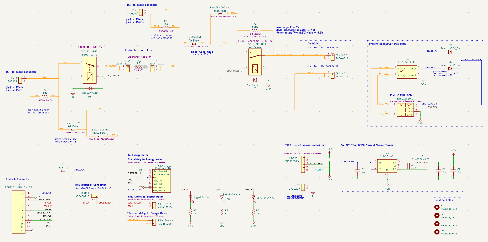
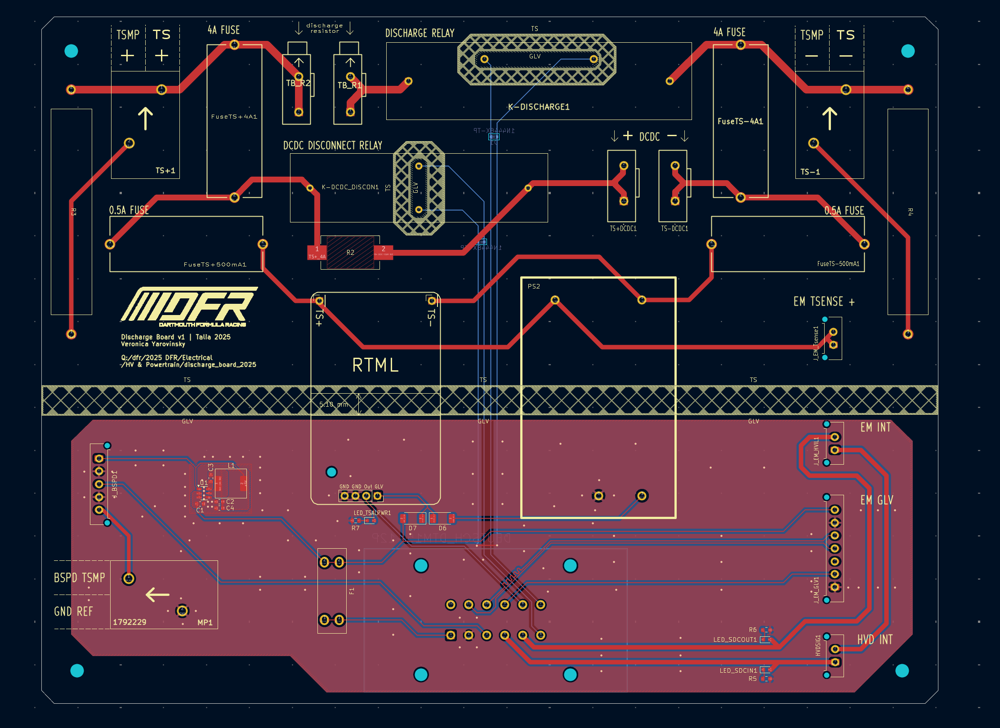
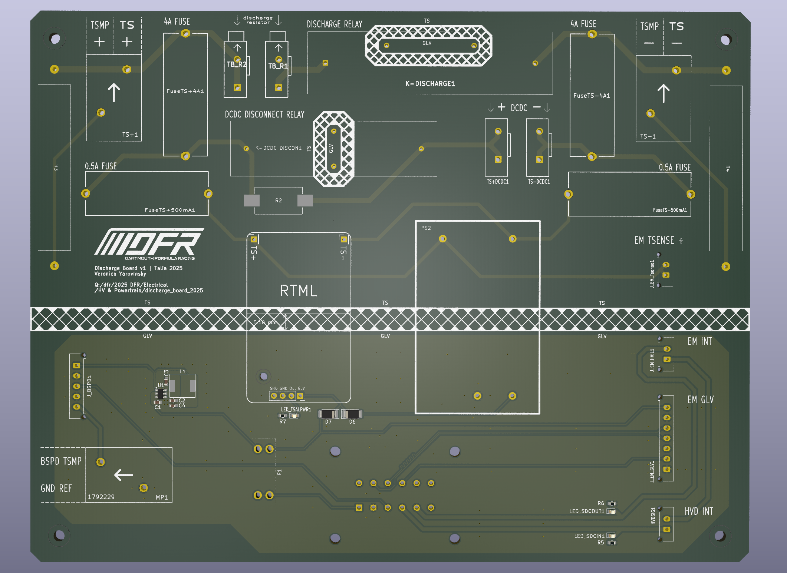
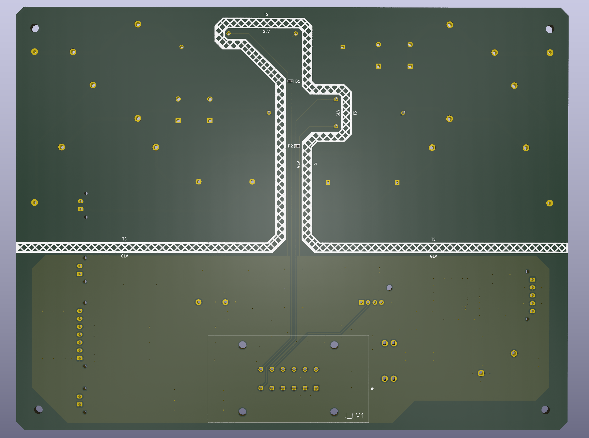

[**< back to projects page**](./)

# High Power Discharge PCB – Dartmouth Formula Racing

I designed this PCB for the Dartmouth Formula Racing (DFR) electric car to connect the high-voltage and low-voltage subsystems internal and external to the car's junction box and to meet FSAE rules for tractive system safety.

The purpose of this PCB was to:
1. safely discharge the car’s high-voltage (TS) bus when the system is shut down or tripped by safety circuits.
2. connect the high-voltage and low-voltage subsystems internal and external to the car's junction box

Purpose: safely discharge the HV bus when car is powered down or tripped by safety systems
→ makes sure that system is below 60V within 5 seconds

Designed in about a week 

FSAE rules compliance was key
Both HV (480 V, car’s tractive system) and GLV for car’s controls
Not really size constrained
Board was designed before the junction box itself was designed

Basically the board connects everything in the car’s junction box including:
* Energy Meter Receptacle
* Bspd current sensor
* Discharge resistor
* HVD (high voltage disconnect) connector: Hirose EM30MSD-A(06)
* DCDC (RSDH-300-12)
* Tractive system measuring points
* Ready to move light (RTML / TSAL)

 

__Board schematics and layout in KiCad__

  

    
  

  

    
  

 

<!-- 

    
    

 -->

__3D Render of Layout in KiCad__

  

    
  

  

    
  

 

<!-- 

  

    
Soldered PCB

    
  

  

    
In the car

    
  

  -->

__Soldered PCB__

    

 

__PCB integrated into the car__

    

 

[**< back to projects page**](./)
