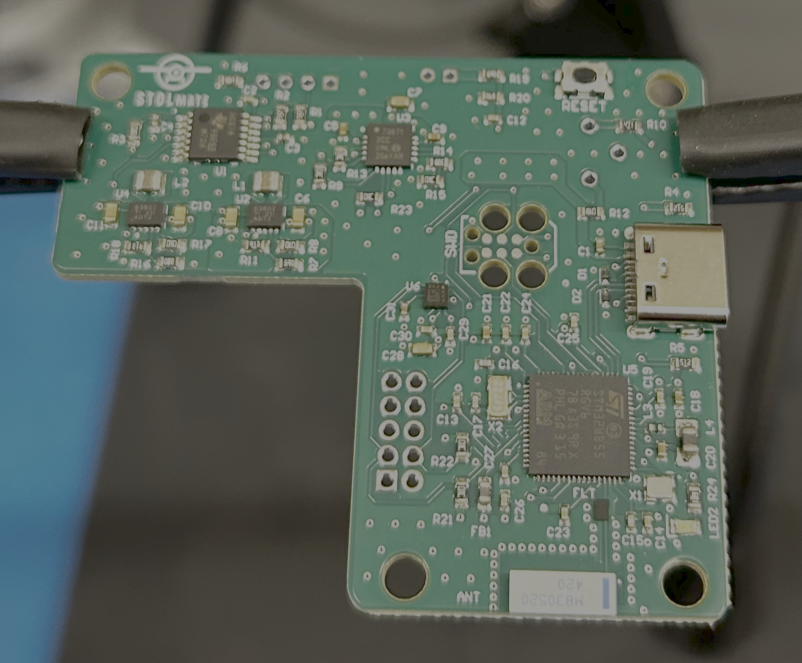
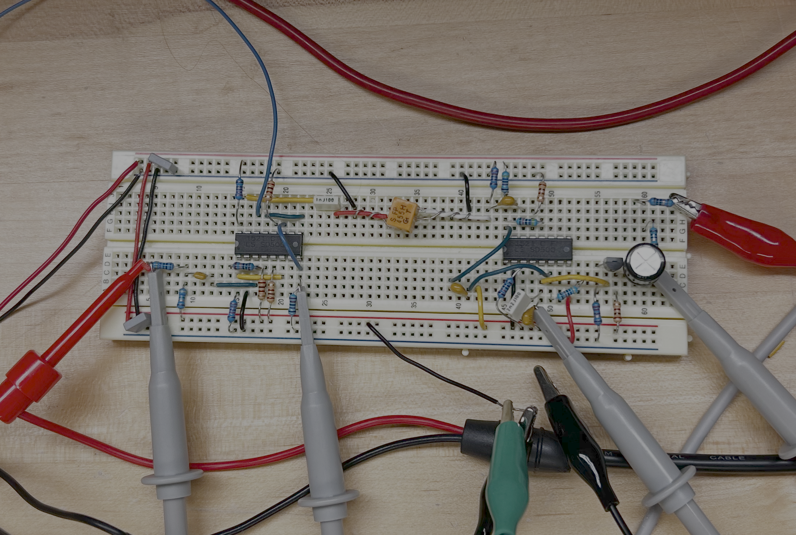
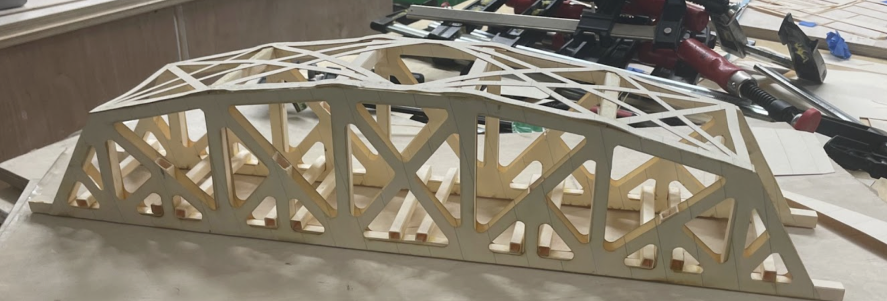

<!-- 

    <h1>Hi! I'm Veronica</h1>

 -->

<intro>
    

      <h1 class="intro-heading">Hi! I'm Veronica</h1>
      
I'm an Electrical Engineering student at Dartmouth College, and I love designing systems, products, electronics, and anything related to energy. When I am not engineering, you’ll find me climbing in the Colorado mountains or surfing on the California coast.

    

    

      
    

</intro>

   
    <h2>Featured Projects</h2>

    <a href="/stolmate" class="card">
      
      

        <h3 class="card-title">PCBA for Airplane Takeoff & Landing Metrics - STOLmate</h3>
        
I designed a PCB — integrating STM32WB microcontroller, Bluetooth antenna, USB-C charging, accelerometer, and TOF sensor interface – based on the previous generation development board-based prototype. I developed embedded firmware and bench-tested the PCB.

      

    </a>

  <a href="/dhe" class="card">
    
    

      <h3 class="card-title">Solar Water Heating System in Uganda – Dartmouth Humanitarian Engineering</h3>
      
Built and operating in Uganda

    

  </a>

  <a href="/dfr" class="card">
    
    

      <h3 class="card-title">High Power Discharge PCB – Dartmouth Formula Racing</h3>
      
I designed a high-voltage discharge safety PCB for a Formula Hybrid electric racecar to meet FSAE rules for tractive system safety. The board interfaces with high-voltage and low-voltage subsystems and is located in the car's junction box.
      

    

  </a>

  <a href="/eda" class="card">
    
    

      <h3 class="card-title">Split-phase Grid-tied High-Power Inverter</h3>
      
For residential load-shedding battery system

    

  </a>

 

<!-- [view more projects   >](./all-projects.html) -->

    <h2>Course Projects</h2>

  <a href="/engs125" class="card">
    
    

      <h3 class="card-title">Class-D Audio Amplifier Buck Converter</h3>
      
I designed, simulated, built, and tested a Class-D amplifier using a buck converter topology to deliver high-efficiency audio output to a 4 Ω speaker. The design achieved over 96% peak efficiency and clean tracking of a sinusoidal audio input from 100 Hz to 20 kHz.

    

  </a>

  <a href="/engs61" class="card">
    
    

      <h3 class="card-title">Heterodyne AM Radio Receiver</h3>
      
I built a transistor-level 455 kHz IF receiver with dual LNAs, switching mixer, ceramic filter, IF amplifier, envelope detector, and audio power amplifier output stage. I simulated my design in LTSpice, then validated the gain of the breadboarded circuit using a modulated 1.4 MHz input from function generator and an oscilloscope, then demonstrated functionality with an audio input and headphones.

    

  </a>

  <a href="/engs26" class="card">
    
    

      <h3 class="card-title">Duck Car Compensator Design</h3>
      
I developed a system model, assessed the stability and performance, then designed and validated a lead system compensator for an autonomous vehicle with the objective of maintaining constant distance between it and a lead vehicle. My closed-loop feedback system design achieved high damping, low settling time, and no steady state error.
      

    

  </a>
  
  <a href="/looma" class="card">
        
        

        <h3 class="card-title">Looma Electrical Redesign</h3>
        
System & PCB Design of Looma Educational System

        

    </a>

  <a href="/engs33" class="card">
    
    

      <h3 class="card-title">Truss Bridge</h3>
      
Our team of three created a paper truss bridge and estimated its strength and failure points. We performed hand-calculations, used SolidWorks FEA analysis to perform deflection and stress tests, then tested the built design on an Instron machine. Our bridge had the highest load-bearing-to-weight ratio of all eight groups in our class.

    

  </a>

  <!-- <a href="/projects/island-opt" class="card">
    
    

      <h3 class="card-title">Island Energy Optimization</h3>
      
Tesla Sales Engineering Case Study

    

  </a> -->

