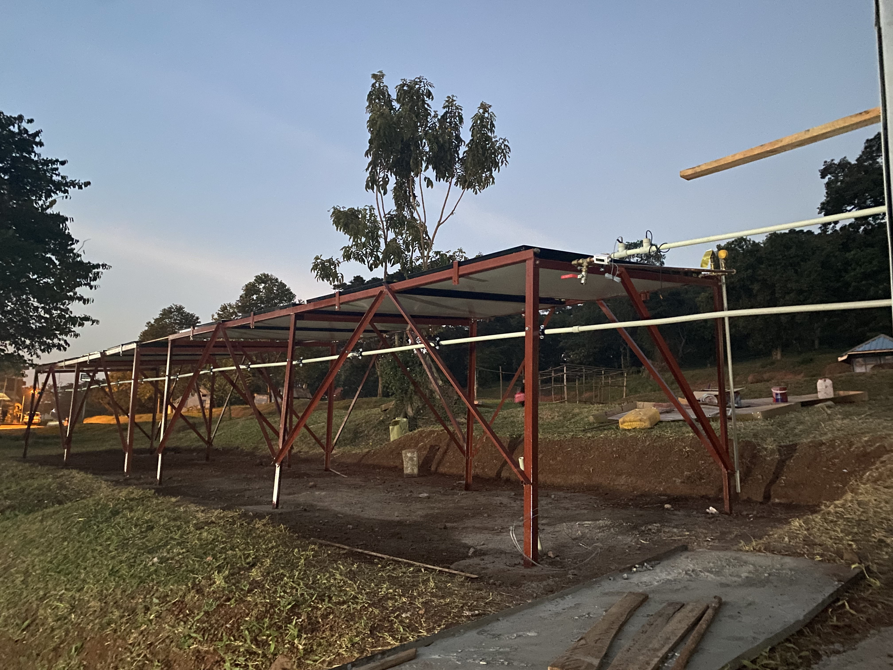
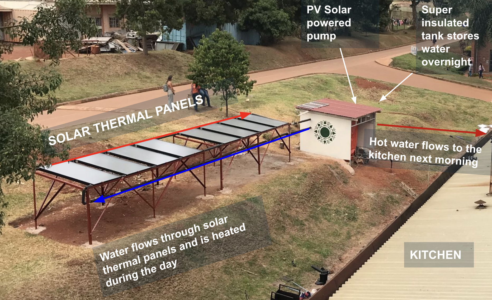
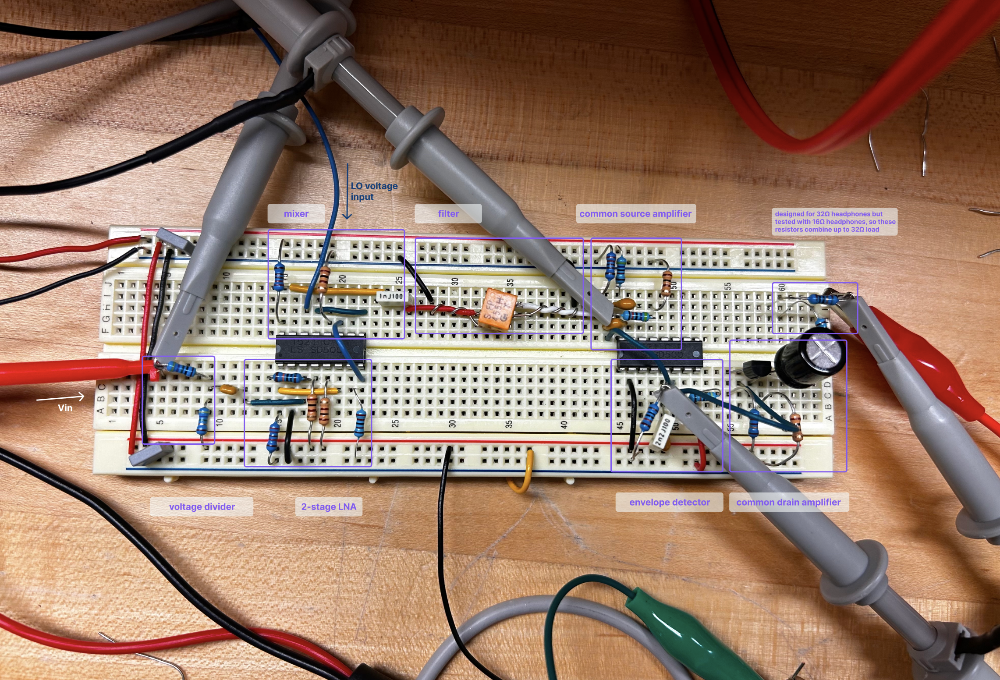
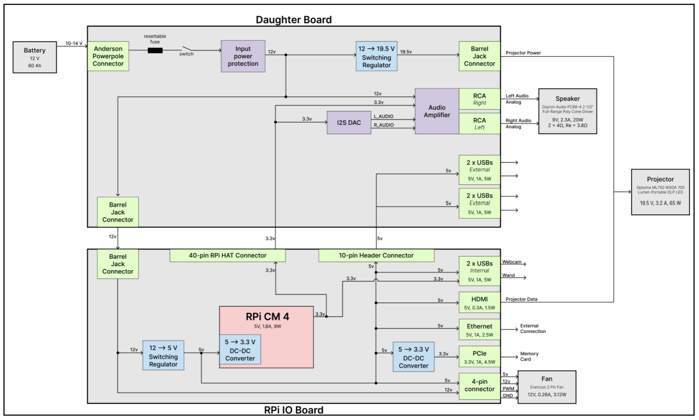
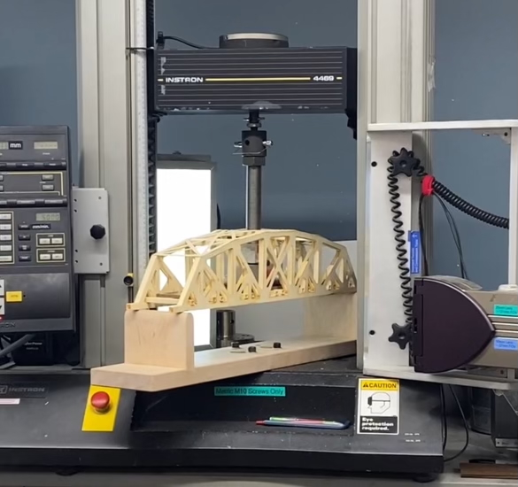

<intro>
    

      <h1 class="intro-heading">Hi! I'm Veronica</h1>
      
<b>I'm an Electrical Engineering student at Dartmouth College, and I love designing systems, PCBs, circuits, and anything related to energy. When I am not engineering, you’ll find me climbing in the Colorado mountains or surfing on the California coast.</b>

      
I started my professional journey with opportunities in energy systems and computer scinece. I have since discovered my passion for electronics, and I hope to pursue a career which allows me to design power electronics or hardware to turn novel ideas into functional products.

      
I hope that you'll take a look at some of my work below! Please note that the content on this website is a work in progress. Feel free to reach out using the contact info on my Resume or LinkedIn (linked at the top of this page) - I am happy to provide more info about myself and my work!

    

    

      
    

</intro>

<!-- =================================== -->
<!-- -------- FEATURED PROJECTS -------- -->
<!-- =================================== -->

   
    <h2>Featured Projects</h2>

<!-- STOLMATE -->

    <a href="/stolmate" class="card">
      
      

        <h3 class="card-title">PCBA for Airplane Takeoff & Landing Metrics - STOLmate</h3>
        
I designed a custom microcontroller-based PCB – integrating a TOF sensor interface, wireless data transmission, and battery charging – based on the previous generation development board-based prototype. I developed embedded firmware, then programmed and validated performance of the PCB.

      

    </a>

<!-- DHE -->
  <a href="/dhe" class="card">
    <!--  -->
    
    

      <h3 class="card-title">Solar Water Heating System in Uganda – Dartmouth Humanitarian Engineering</h3>
      
I co-led the design, implementation, and testing of an off-grid solar water heating system to displace the use of firewood for cooking at a 10,000 student university in Kampala, Uganda. Received funding awards from the Thayer School of Engineering Dean’s Fund, the Irving Institute, and the NSF Innovation Corps.

    

  </a>

<!-- DFR Discharge Board -->
  <a href="/dfr" class="card">
    
    

      <h3 class="card-title">High Power Discharge PCB – Dartmouth Formula Racing</h3>
      
I designed this PCB for the Dartmouth Formula Racing (DFR) electric car to connect the high-voltage and low-voltage subsystems internal and external to the car's junction box and to meet FSAE rules for tractive system safety.
      

    

  </a>

<!-- EDA Inverter -->
  <!-- <a href="/eda" class="card">
    
    

      <h3 class="card-title">Split-phase Grid-tied High-Power Inverter</h3>
      
I designed a grid-tied split-phase 3kVA inverter for a residential load-shedding battery system. I modeled the design in Simulink for efficiency and cost optimization, ensured compliance with UL 1741 standards, and routed the PCB, then assembled and tested it.

    

  </a> -->

 

<!-- ================================= -->
<!-- -------- COURSE PROJECTS -------- -->
<!-- ================================= -->

    <h2>Course Projects</h2>

<!-- ENGS 125 - Audio Amplifier -->

  <a href="/engs125" class="card">
    
    

      <h3 class="card-title">Class-D Audio Amplifier</h3>
      <!-- <h4 class="card-subtitle">Power Electronics</h4> -->
      
I designed, simulated, built, and tested a Class-D amplifier using a buck converter topology to deliver high-efficiency audio output to a 4 Ω speaker. The design achieved over 96% peak efficiency and clean tracking of a sinusoidal audio input from 100 Hz to 20 kHz.

    

  </a>

<!-- ENGS 61 - Heterodyne AM Radio Receiver -->
  <a href="/engs61" class="card">
    
    

      <h3 class="card-title">Heterodyne AM Radio Receiver</h3>
      
I built a transistor-level 455 kHz IF receiver with dual LNAs, switching mixer, ceramic filter, IF amplifier, envelope detector, and audio power amplifier output stage. I simulated my design in LTSpice, then validated the gain of the breadboarded circuit using a modulated 1.4 MHz input from function generator and an oscilloscope, then demonstrated functionality with an audio input and headphones.

    

  </a>

<!-- ENGS 26 - Duck Car Compensator Design -->
  <a href="/engs26" class="card">
    
    

      <h3 class="card-title">Duck Car Compensator Design</h3>
      
I developed a system model, assessed the stability and performance, then designed and validated a lead system compensator for an autonomous vehicle with the objective of maintaining constant distance between it and a lead vehicle. My closed-loop feedback system design achieved high damping, low settling time, and no steady state error.
      

    

  </a>

<!-- ENGS 75 - Looma -->
  <a href="/looma" class="card">
        
        

        <h3 class="card-title">Looma Electrical Redesign</h3>
        
I defined electrical and mechanical requirements for a Raspberry Pi CM4-based educational device, then designed schematics for a custom motherboard integrating power management, audio, and peripheral interfaces.

        

    </a>

<!-- ENGS 33 - Truss Bridge -->
  <a href="/engs33" class="card">
    
    

      <h3 class="card-title">Truss Bridge</h3>
      
Our team of three created a paper truss bridge and estimated its strength and failure points. We performed hand-calculations, used SolidWorks FEA analysis to perform deflection and stress tests, then tested the built design on an Instron machine. Our bridge had the highest load-bearing-to-weight ratio of all eight groups in our class.

    

  </a>

  <!-- <a href="/projects/island-opt" class="card">
    
    

      <h3 class="card-title">Island Energy Optimization</h3>
      
Tesla Sales Engineering Case Study

    

  </a> -->

