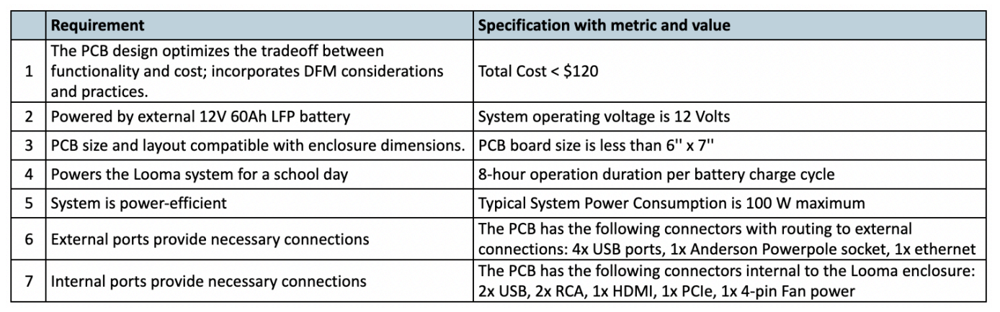
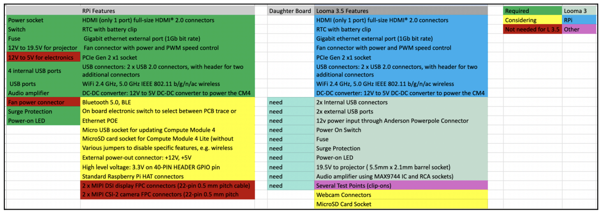
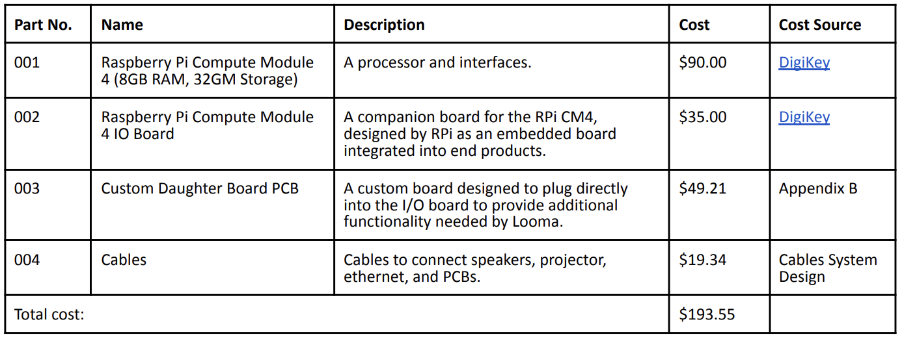
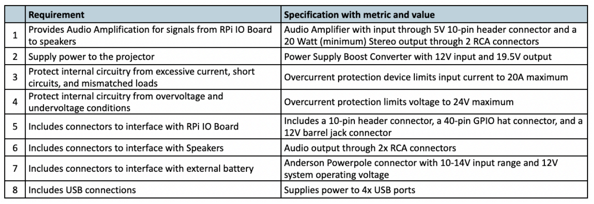

# Looma Electrical Redesign

The [Looma Education System](https://www.looma.education/) is a solar-powered box which delivers educational content to classrooms in Nepal. The enclosure contains a computer, projector, sound system, webcam, microphone, USB, ethernet, and WiFi. 

The objective of the project was to design the Looma 3.5 electrical system with the Raspberry Pi Compute Module 4 as the CPU, a re-design from Looma 3.0 which uses the Odroid C4 CPU.

My contributions involved:
* compiling and calculating the electrical requirements of the Looma system components
* designing the schematics & layout of a custom PCB
* selecting appropriate cables internal to the Looma system
* debugging the previous generation (Looma 3.0) motherboard PCB

Unless otherwise noted, all diagrams, presentations, and diagrams shown on this page were created by me.

This project was sponsored by Looma Education and Skip Stritter.

--------

## Electrical System Design & Design Process

__Requirements, Specifications, & Rationale__

Many of the electrical system requirements were provided through the requirements outlined by Skip Stritter, Looma CEO, in the slide deck titled “Looma 2024 ENGS 199”. Additional requirements were identified from the mechanical constraints of the Looma 3.5 enclosure, the electrical requirements identified or calculated from the datasheets of the other system components. The relevant requirements and their associated specifications are listed below:

    

__Concepts for Electrical System Architecture__

To meet the Electrical System Specifications, three concepts were considered for the high-level
architecture of the electrical system:
1. Raspberry Pi Compute Module 4 (RPi CM4) with Custom Input/Output Motherboard (original plan suggested by Skip Stritter)
2. Raspberry Pi Compute Module 4 with Raspberry Pi IO Board and a Custom Daughter Board PCB
3. Raspberry Pi 4 Model B (which includes RPi CM4 technology and IO functionality integrated into
one product) with a Custom Daughter Board PCB

To evaluate these concepts, we generated a list of features contained by each Raspberry Pi product, color-coded to demonstrate the functionality utilized by the Looma 3.5 system, as shown below:

    

--------

## System Architecture Design and Development Process

The Looma 3.5 electrical system architecture employs a modular design which distributes functionality across four “sub-assemblies”:
1. **Raspberry Pi Compute Module 4 (abbreviated as RPi CM4):** a system-on-module (SOM) designed to be inserted into a carrier board.
2. **Raspberry Pi IO Board (abbreviated as RPi IO Board):** a companion board for the RPi CM4, designed by RPi as an embedded board integrated into end products.
3. **A new custom “Daughter Board” PCB (abbreviated as DB PCB):** a custom PCB attached to the RPi IO board pins, designed to meet specifications and functionality requirements which are not
satisfied by the RPi IO Board.
4. **Cable System:** the set of cables, wires, connectors, and associated items which connect the first three sub-assemblies to the other components of the Looma system, including the fan,
projector, speaker, and external battery.

The modular design of our electrical system, composed of three connected electronic boards (RPi CM4, RPi IO Board, and DB PCB), enables easier servicing, and replacement would be limited to the faulty module rather than the entire electrical system.

The Wiring Diagram below (Figure 1) showcases the functional blocks and connectors which form the design features of the DB PCB, illustrate the utilized functionality of the RPi IO board, and highlight the connections required between the two boards.

    

The diagram serves as a system-level block diagram, demonstrating how the Looma 3.5 electrical system design integrates into the overall Looma system architecture. The diagram lists the operating voltage levels, the peak current, and power draw of each component with ratings obtained or calculated from the respective datasheets. These electrical ratings and requirements were centralized in a Google Sheets file and adapted into a spreadsheet-based tool for estimating the current and power requirements of the system, the RPi IO Board, the DB PCB, and the system components. The tool, included in the Project
Documents (see Appendix A), enabled us to verify that our system design meets certain specifications,
such as limiting the peak power draw of the system to less than 100W and providing 8-hour operation
duration per battery charge cycle. Furthermore, the calculated electrical ratings inform the design and
component selection of the DB PCB Schematics as well as the Cable System Design.

Due to inherent mechanical constraints of the Looma enclosure, the location and orientation of the electrical boards are key design decisions which:
1. validate the compatibility of RPi IO board size and port locations with the overall system,
2. inform cable mechanical constraints such as length and bend radius,
3. indicate changes required to the port holes in the Looma enclosure, and
4. Guide PCB layout requirements for the next design phase of the DB PCB.

### Electrical System Bill of Materials

The materials for our design consist of the 4 high-level components/categories:

    

--------

## Custom PCB Schematic Design & Design Process

The key functionality of the Daughter Board PCB, determined by the Looma 3.5 Electrical System Architecture Design includes a power distribution, regulation, and conversion network, a Class D audio amplifier driving a speaker, and USB hub enabling 4 external USB connections to connect to a 2-port USB Connector. The values of the Specifications were informed by the System Power Analysis
calculations, general electronics design principles for surge protection, and specs from the Raspberry Pi IO Board datasheet.

    

The schematics, which were constructed, verified, and tested in Altium Designer, utilize a hierarchical design structure which
enabled a top-down design, bottom-up implementation and testing process for the development of the schematics.

### Top-Level Functional Block Schematic

A Top-Level Functional file demonstrates the modularization of the design into functional blocks, the connections between those blocks, and the connectors interfacing with other Looma components.

[ INSERT ]

### Input Power Protection Circuitry Schematic

Uses a Power Field-Effect Transistor for
reverse polarity protection and an LTC7860 Integrated Circuit (IC) to protect internal circuitry from damaging transient voltage events as well as long-term overvoltage faults and to filter AC
noise for improved signal integrity.

[ INSERT ]

###  DAC for Audio 12S Schematic

A Digital to Analog Converter which transforms the Pulse-Code Modulation (PCM) audio output from the RPi CM4 to analog audio stereo inputs for the MAX9744 Class D Amplifier configured to receive digital control signals through the I2C Communication Protocol for digital volume control.

[ INSERT ]

### Project Power Supply Unit Schematic

A voltage boost converter which utilizes a switching converter topology. 

[ INSERT ]

### Audio Amplifier Schematic

The Audio Amplifier utilizes the MAX9744 Class D Amplifier in I2C Mode and includes an LC Output Filter.

[ INSERT ]

### Dual USB

[ INSERT ]

### Schematics Verification

The design was verified through manual inspection of the schematics, following the PCB schematic checklist suggested by Sierra Circuits, as well as through verification features offered by Altium. The verification through Altium included:

* **A Design Rule Check (DRC)**, which assesses the logical and physical integrity of the design and lists any warnings or errors.
* **A Transient Analysis Simulation**, which simulates operation of the system over a specified duration and indicates voltage and current values at specified nodes or measurement points.
* **A DC Sweep Simulation**, which indicates voltage and current values at specified locations when provided an input voltage range (run with 10-14V input range for our design).

 

[< back](./)