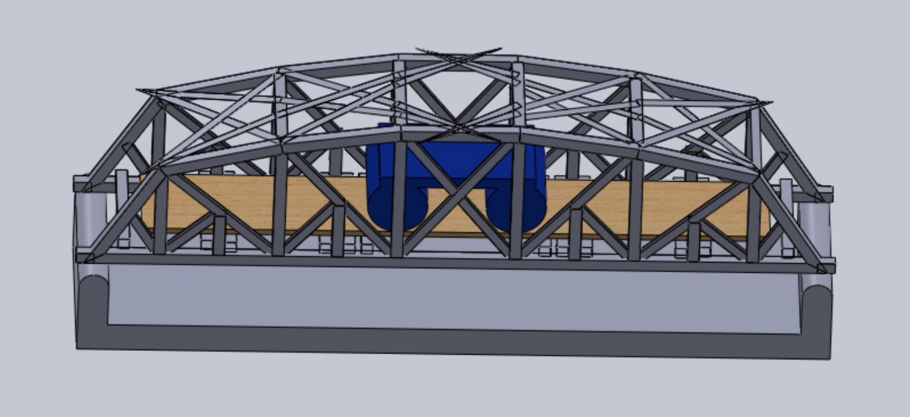
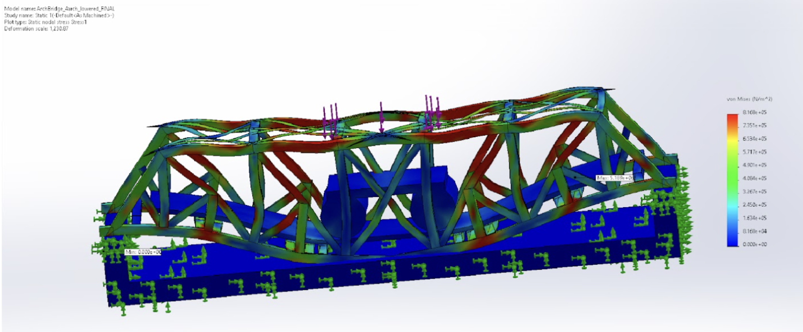
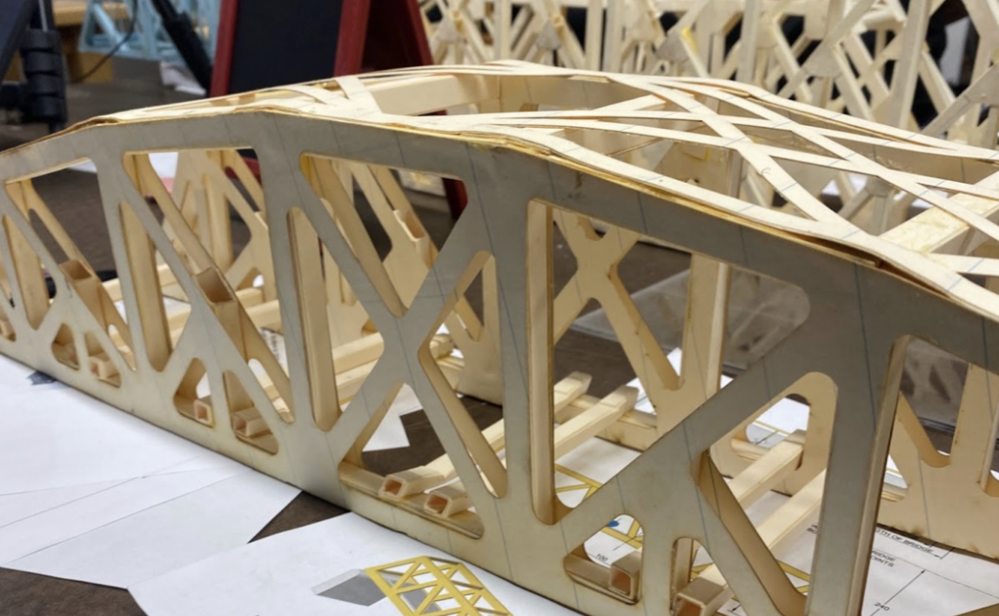

# Truss Bridge

Our team of three created a paper truss bridge and estimated its strength and failure points. This was the term-long project for my solid mechanics course at Dartmouth College. My team and I were challenged with designing, analyzing, and testing a structurally sound bridge. We were further challenged with using manilla folders as a building material.

--------

## Design Process

We iterated through multiple bridge designs, shown below. We modeled each in SolidWorks, hand-calculated the compression and tension forces of the side truss structure, performed FEA simulations, and adjuted our design based on the learnings.

    

--------

## Final Design

Our final, built design is shown below.

    

--------

## SolidWorks Model

The final design for our bridge, as modeled in SolidWorks:

    

Our final model included a lattice inspired tension design at the top. We noticed from past simulations that the top compressive members at the arch were getting pushed down as we increased the load applied, requiring a tension force at the top to alleviate the stress on the compressive members.

We created a custom material in SolidWorks to more accurately model the properties of the manila paper we were using as our material. Through tensile tests and compression tests, we found that the Young’s Modulus for manilla paper is 1.05E-10. The material properties of manila had to be separately applied to the custom members we dimensioned for the weldments features by applying a path for Weldments profile to find. Providing Weldments with a path required solidworks to view our one bridge body to be completely made out of manila folder paper.

--------

## FEA Analysis

CAD simulation for finding the maximum amount of stress the bridge can hold:

    

We used SolidWorks FEA analysis to perform deflection and stress tests, ensuring our bridge met the project's minimum weight loading requirements. This approach enabled us to virtually iterate on our design, resulting in the highest load-bearing-to-weight ratio of all eight groups in our class.

--------

## Built Design

Point of failure during testing:

    

During testing, the bridge broke at the 8mm x 8mm crossmembers of the deck. The shear force was evenly split between the two central crossmembers, this is evidenced above by the resulting step offs at the edge of the side member. The members buckled after the application of the load changed once the provided deck cracked.

--------

## Final Report

[Link to Final Report](https://drive.google.com/file/d/1Z7scb8cWfSEA4zsg4Kii4mdTYNROgDUh/view?usp=sharing)

 

[< back](./)