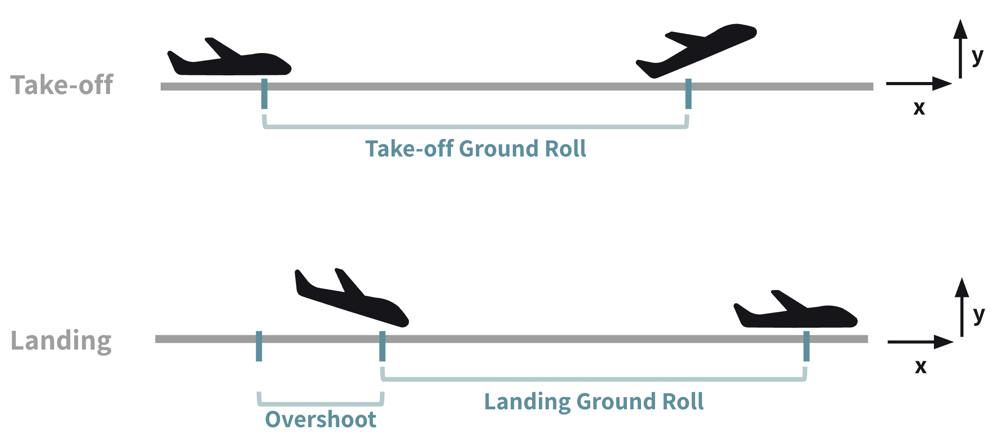
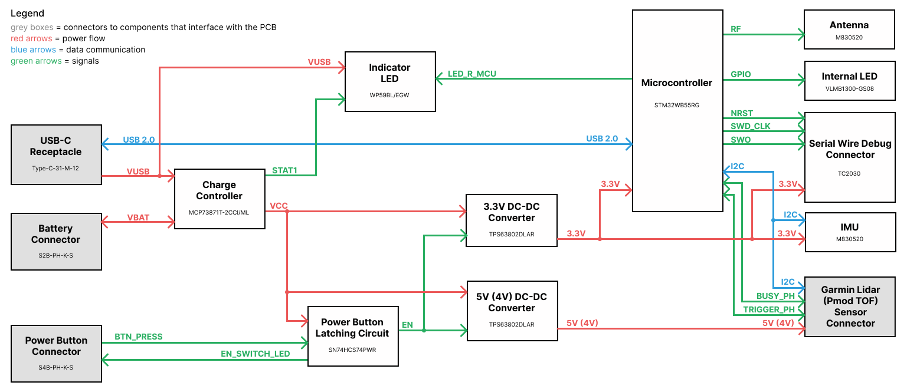
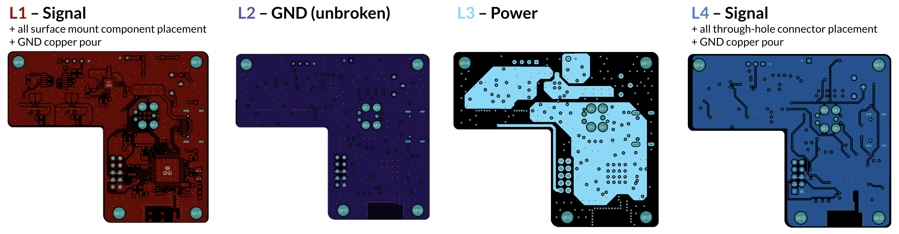
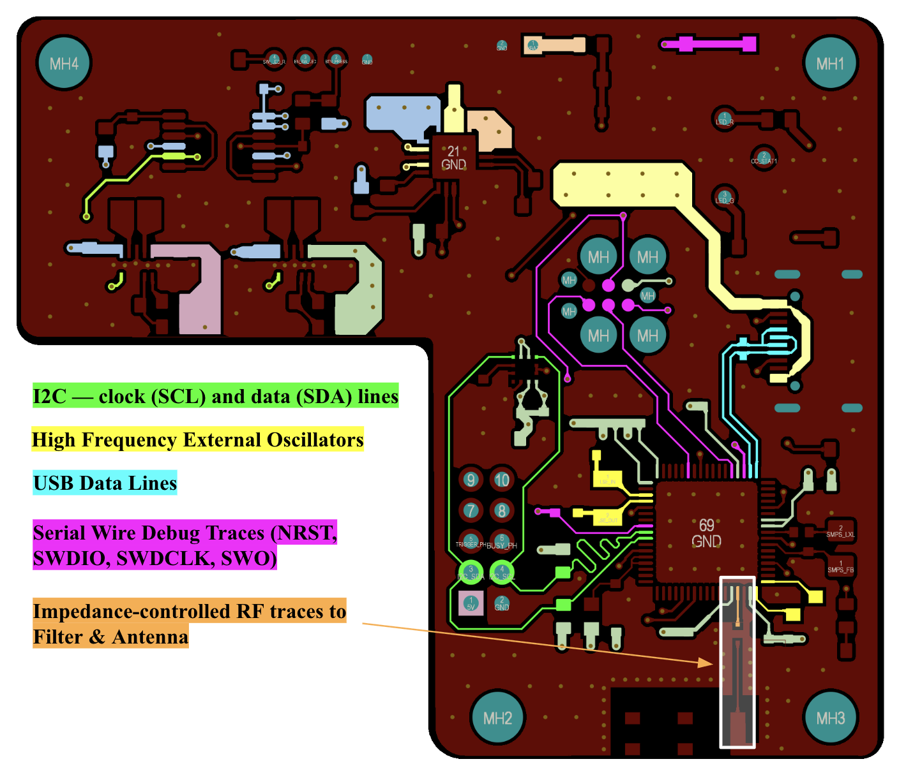
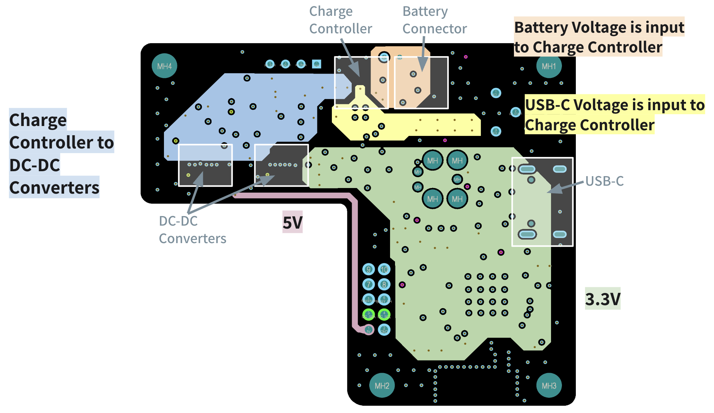
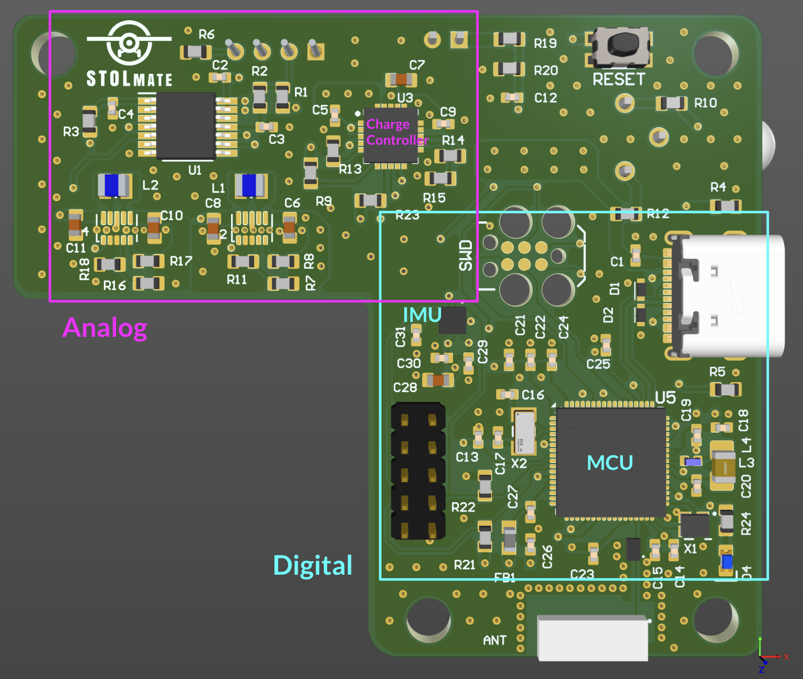
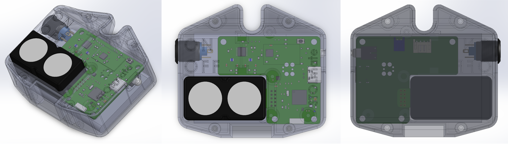
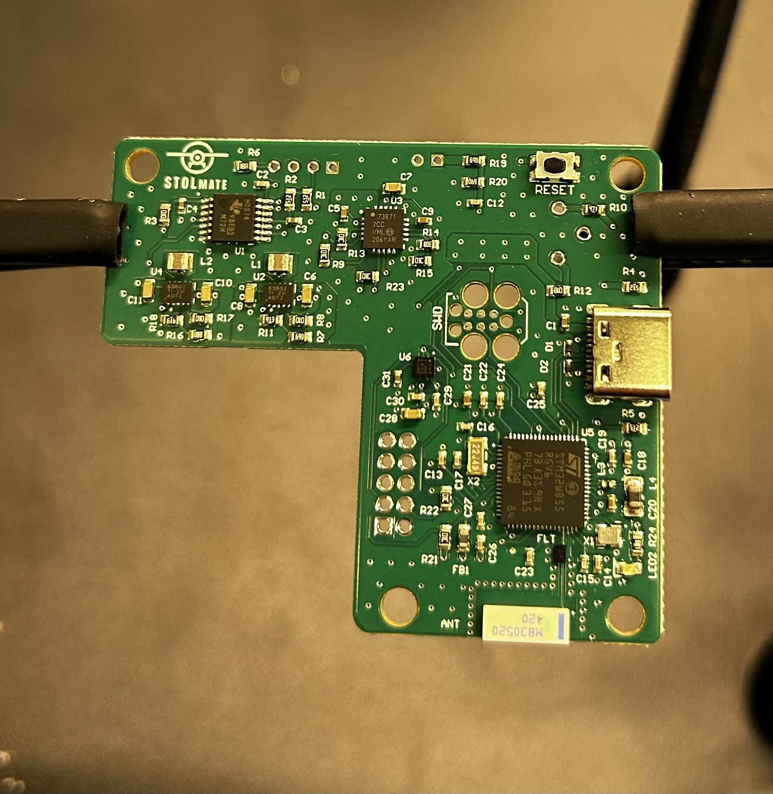
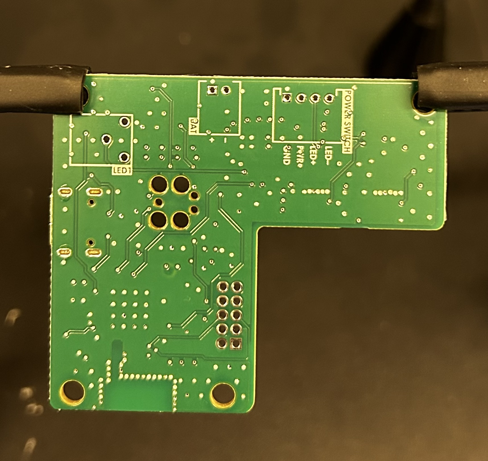

[**< back to projects page**](./)

# PCBA for Airplane Takeoff & Landing Metrics - STOLmate

I designed a custom microcontroller-based PCB – integrating a TOF sensor interface, wireless data transmission, and battery charging – based on the previous generation development board-based prototype. I developed embedded firmware, then programmed and validated performance of the PCB. 

This project was part of my work for my engineering capstone project. I focused on the hardware design aspects of the project, and my contributions to the project involved:
* PCB design (solely responsible)
* firmware development
* sensor & accelerometer testing to inform future hardware development 

 
<h3>Background</h3>

  

    
<b>Short Take-Off and Landing</b> performance measures an aircraft’s ability to minimize the runway distance required for takeoff and landing. This diagram illustrates the 3 STOL measurements reported to the user:

    <ul>
        <li>takeoff ground roll</li>
        <li>landing ground roll</li>
        <li>overshoot</li>
    </ul>
  

  

    
  

 

STOLmate is the first commercially-available device to enable pilots to train for STOL competitions by determining their takeoff and landing performance independently, and STOLmate 2.0 (what I worked on) enhances the features of the pre-existing model.

----------

<h3>PCB Functional Requirements</h3>

* Garmin Lidar compatibility
* Incorporates Accelerometer
* Bluetooth functionality
* LED indicators for power & charging
* Battery-powered
* Tracks battery charge %
* USB-C charging
* Bluetooth data transmission functionality
* Fits within constraints of existing casing design
* Minimizes part count

<b>Other Considerations</b>

<ul>
    <li>Mechanical Constraints</li>
    <li>DFM / DFA</li>
    <li>Regulatory Compliance</li>
    <li>Cost</li>
</ul>

<h3>Block Diagram of PCB Architecture</h3>

The diagram below shows the functional blocks of the design.

    

 

<h3>The PCB is a 4-layer impedance-controlled design</h3>

    

  

    <h4>Signal Layer</h4>
    
  

  

    <h4>Power Plane</h4>
    
  

 

  

    <h3>PCB Layout & Routing Considerations</h3>
    <ul>
        <li>EMI</li>
        <li>Noise</li>
        <li>Crosstalk</li>
    </ul>
    <ul>
        <li>Separation of analog & digital signals</li>
        <li>High-frequency signals</li>
        <li>High-speed signal routing</li>
    </ul>
  

  

    
  

 

<h3>Mechanical constraints</h3>

Board shape & connector placement determined by mechanical constraints

    

 

__PCBA recieved from the manufacturer (JLCPCB)__

  

    
  

  

    
  

 

 

[**< back to projects page**](./)
